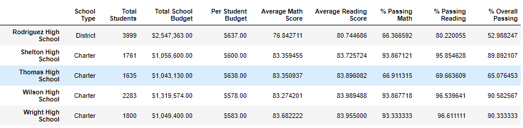
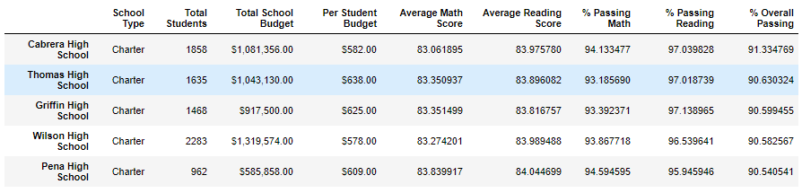
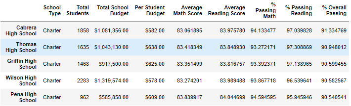
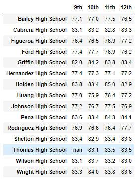
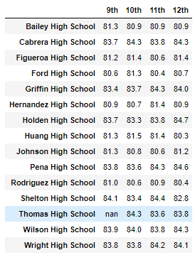
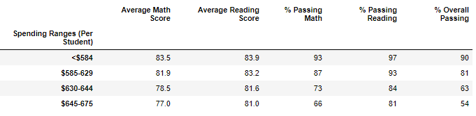
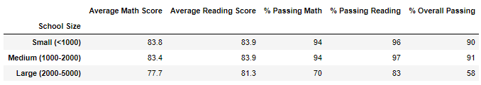
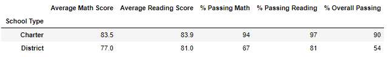

# School_District_Analysis

## Project Overview

The following analysis was performed to deteremine the results of removing the 9th grade math and reading scores for Thomas High School on the following data summaries:

1. School District Summary
2. School Summary
3. Top 5 & Bottom 5 Schools based on Overall Passing percentage
4. a) Average Math & Reading Scores by Grade
   
   b) Scores by School Spending
   
   c) Scores by School Size
   
   d) Scores by School Type

### ***NOTE: Due to GitHub DataFrame rendering issues for Jupyter Notebook files, the [PyCitySchools_Challenge.ipynb](PyCitySchools_Challenge.ipynb) file can also be viewed [here](https://nbviewer.jupyter.org/github/joshb738/School_District_Analysis/blob/main/PyCitySchools_Challenge.ipynb).***

## Resources 
- Software: Anaconda 4.9.2, Jupyter Notebook 6.1.4, Python 3.8.5
- Data Sources: 
   1. Data Analysis: [Challenge Analysis](PyCitySchools_Challenge.ipynb), [Module Data](PyCitySchools.ipynb)
   2. Raw data: [students_complete.csv](Resources/students_complete.csv), [schools_complete.csv](Resources/schools_complete.csv)

## Results: 

The removal of 9th grade reading and math scores from Thomas High School has resulted in the following changes:  

#### 1. **School District Summary**
   - **0.1 decrease** in the Average Math score.
   - **0.2% decrease** in the students passing math.
   - **0.1% decrease** in the students passing reading.
   - **0.3% decrease** in the students overall passing score.
   
   a) **Original**
   

   
   

   
   b) **Revised**    
   

   
   

   
#### 2. **School Summary**
   
   a) **Original** 
   
   

   
   

   
   b) **Results excluding 9th grade math and reading scores for Thomas High School**   [(Ref:Cell 16)](https://nbviewer.jupyter.org/github/joshb738/School_District_Analysis/blob/main/PyCitySchools_Challenge.ipynb)
   
   - An approximate **26.36%** decrease in the students passing math percentage.
   - An approximate **27.65%** decrase in the students passing reading percentage.
   - An approximate **25.87%** increase in the students overall passing percentage. 
   
   

   
   

   
   c) **Results excluding all 9th grade students from Thomas High School**    [(Ref:Cell 27)](https://nbviewer.jupyter.org/github/joshb738/School_District_Analysis/blob/main/PyCitySchools_Challenge.ipynb)
   
   - An approximate **26.28%** inrease in the students passing math percentage.
   - An approximate **27.63%** increase in the students passing reading percentage.
   - An approximate **25.55%** increase in the students overall passing percentage. 
   
   

   
   

#### 3. **Top & Bottom 5 Schools based on Overall Passing percentage**
   
   a) With and Overall Passing percentage of **90.63%** Thomas High has mainted the second-place position in the top 5 schools.
   
   - **Top 5 Schools Revised** 
   

   
   

   
   - **Top 5 Schools Original**
   

   
   

   
   b) No reportable effects have occured to the [Bottom 5](Resources/bottom5_schools_revised.PNG) performing schools.
   
#### 4. a) Average Math & Reading Scores by Grade
   - The most notable change to the Average [**Math**](Resources/average_math_score_revised.PNG) (left) and [**Reading**](Resources/average_reading_score_revised.PNG) (right) scores are the Thomas High School 9th grade results have been nullified for both tables without having any effect on grades 10 - 12.
  
   
   
  - Based on the revised results, no reportable changes have been made to the following DataFrames:
  
   b) **Scores by School Spending**
   

   
   

   
   c) **Scores by School Size**
   

   
   

   
   d) **Scores by School Type**
   

   
   

