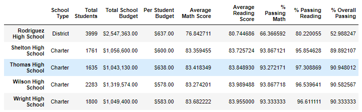

# School_District_Analysis

## Project Overview
The following analysis was performed to deteremine the effects of removing the 9th grade math and reading scores from Thomas High School (THS) on the following summary data:

1. School District Summary
2. School Summary
3. Top 5 & Bottom 5 Schools based on Overall Passing percentage
4.

***NOTE: Due to GitHub dataframe rendering issues for Jupyter Notebook files, the [PyCitySchools_Challenge.ipynb](joshb738/School_District_Analysis/blob/main/PyCitySchools_Challenge.ipynb) file can also be viewed [here](https://nbviewer.jupyter.org/github/joshb738/School_District_Analysis/blob/main/PyCitySchools_Challenge.ipynb)***

## Resources 
- Software: Anaconda 4.9.2, Jupyter Notebook 6.1.4, Python 3.8.5
- Data Sources: - [students_complete.csv](resources/students_complete.csv), [schools_complete.csv](resources/schools_complete.csv)

## Results: 

The removale of the THS 9th grade reading and math school has resulted in the following changes:  

1. **School District Summary"**
   - 0.1 decrease in the Average Math score.
   - 0.2% decrease in the students passing math.
   - 0.1% decrease in the students passing reading.
   - 0.3% decrease in the students overall passing score.
   
   a) **Original**
   

   
   

   
   b) **Revised**
   

   
   

   
2. **School Summary**
   - Approximately **30.11%** increase in the students passing math.
   - Approximately **27.36%** inccrease in the students passing reading.
   - Approximately **25.55%** icrease in the students overall passing score.
   
   a) **Original**
   

   
   

   
   b) **Revised**
   

   
   

3. How does replacing the ninth graders’ math and reading scores affect Thomas High School’s performance relative to the other schools?
4. How does replacing the ninth-grade scores affect the following:
  - Average Math and reading scores by grade
  - Scores by school spending
  - Scores by school size
  - Scores by school type

## Summarry
